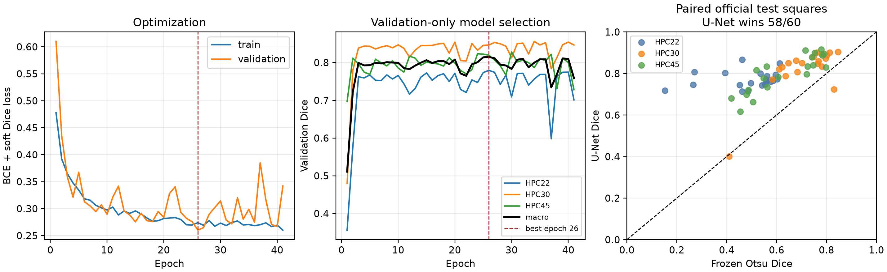

# Quantitative SEM Morphometry of Porous Functional Coatings

Reproducible phase-1 analysis of the Zenodo dataset **“A supraparticle-based approach to robust biomimetic superhydrophobic coatings”** (DOI: [10.5281/zenodo.16054027](https://doi.org/10.5281/zenodo.16054027)). The project is deliberately scoped to **morphology–wetting/durability associations**. It does not predict emissivity, reflectance, or absorption because the source data contain no optical-property labels.

Repository: [z13918481356-ship-it/porous-coating-sem-morphometry](https://github.com/z13918481356-ship-it/porous-coating-sem-morphometry)

## Results at a glance

| Question | Evidence | Defensible conclusion |
|---|---|---|
| Can multi-scale SEM morphology be quantified? | 28 SEM/SEM-like images inventoried; 18 coating images calibrated; threshold sensitivity and matched-window checks included | Yes, as image-derived 2D descriptors with explicit contrast and field-of-view limitations |
| Can morphology predict coating wetting? | Only 8 independent matched conditions; Random Forest contact-angle MAE 2.62° versus 2.91° mean baseline; permutation p=0.224 | Exploratory association only; no deployable property predictor |
| Does global Otsu transfer to independent porous FIB-SEM? | Locked 24-square median Dice 0.584 | No; direct classical transfer fails |
| Does supervised segmentation help? | Official 180/60/60 split; U-Net test median Dice 0.805 versus Otsu 0.604; paired median gain 0.182 (95% CI 0.148-0.201) | Substantial improvement, but the preregistered 0.85 overall gate and HPC22 material gate are not met |



The main scientific distinction is deliberate: **coating morphology-property analysis** and **external segmentation validation** are separate evidence streams. PAAO and FIB-SEM data never enter the wetting/durability model.

## What is implemented

- TIFF metadata and scale-bar calibration, with a manual CSV fallback for PNGs.
- Dataset inventory, macOS resource-fork filtering, workbook de-duplication, and condition-level metadata.
- Otsu + morphology and distance-transform watershed segmentation.
- Solid/pore area fraction, equivalent diameter, circularity, aspect ratio, pore connectivity, edge density, nearest-neighbour spacing, and multi-scale GLCM/LBP texture.
- Contact angle, hysteresis, roll-off angle, pinning fraction, tape/abrasion cycle extraction from the heterogeneous workbooks.
- Condition-level joins; GroupKFold predictions for Ridge and Random Forest so paired magnifications never cross folds.
- Threshold sensitivity, cross-magnification consistency, group bootstrap intervals, and failure-case flags.
- Row-level SEM/property pairing audit, with unsupported post-test joins explicitly excluded.
- A normalized condition/coupon/SEM-field/property-workbook hierarchy; missing coupon IDs remain null.
- Durability trajectories with retention, slopes, operational failure cycles, right censoring, and threshold sensitivity.
- Condition-level leave-one-out models with a training-mean baseline and target-permutation tests.
- Matched-physical-window cross-magnification recomputation.
- A balanced 24-patch dual-expert annotation package and external PAAO/FIB-SEM validation adapters.
- Exactly five analysis figures and a two-page Chinese DOCX/PDF summary.

## Scientific guardrails

The archive contains 28 SEM/SEM-like images but hundreds of wetting workbooks, many of which are duplicates or one cycle of the same preparation series. Images and property measurements are joined only when filename/folder metadata identify the same preparation and durability state. Rows are not treated as independent merely because they occur in separate files.

The primary coating dataset has **no pixel-level reference masks**, so no U-Net accuracy claim is made for coating SEMs. The independent FIB-SEM dataset does provide expert masks and official train/validation/test partitions; these are used in a separate supervised U-Net benchmark. Its scores describe porous-polymer FIB-SEM only and cannot be transferred to coating images by assertion. Training on Otsu pseudo-labels remains prohibited.

## Reproduce the coating analysis

1. Download `Dataset.zip` from Zenodo and extract it to `data/raw/zenodo_16054027/`.
2. Create an environment and install `requirements.txt`.
3. Run:

```powershell
python scripts/run_pipeline.py --data-root data/raw/zenodo_16054027 --output-root outputs
python scripts/build_pairing_audit.py
python scripts/build_annotation_set.py
python scripts/build_hierarchy_tables.py
python scripts/build_durability_metrics.py
python scripts/evaluate_small_data_models.py --permutations 200
python scripts/build_matched_scale_consistency.py
python scripts/build_report.py --output-root outputs --report-root report
```

For this workspace, the dependencies are vendored in `.deps`; the wrapper inserts that directory on `sys.path` automatically.

## Reproduce the independent FIB-SEM benchmark

The external archive is approximately 9.2 GB and is intentionally excluded from Git. After downloading and verifying `fib_sem_cnn.zip` from Zenodo record 4317170:

```powershell
pip install torch
python scripts/extract_fibsem_supervised_dataset.py
python scripts/train_fibsem_unet.py
python scripts/build_fibsem_unet_diagnostics.py
```

The frozen design is recorded before training in `FIBSEM_UNET_LOCKED_PROTOCOL.md`. Expected checkpoint selection and test statistics are listed in `REPRODUCIBILITY.md`; reproducing them must not involve threshold or architecture selection on the official test split.

## Repository guide

- `src/morphometry/`: calibration, classical segmentation, morphometry, grouped modeling, and compact U-Net.
- `scripts/`: data acquisition, audits, feature/model analyses, external benchmarks, and report generation.
- `configs/`: manual calibration and analysis configuration.
- `tests/`: fast unit tests used by GitHub Actions.
- `outputs/`: compact result tables and publication/diagnostic figures; raw archives and model weights are excluded.
- `report/`: final two-page Chinese DOCX and PDF brief.
- `DATA_CARD.md`: provenance, unit of analysis, exclusions, limitations, and appropriate use.
- `FIBSEM_*` and `MODEL_CARD_FIBSEM_UNET.md`: locked protocols, results, failures, and model scope.

## Outputs

- `outputs/image_manifest.csv`: one row per image, physical calibration and preparation fields.
- `outputs/properties_clean.csv`: one row per valid workbook after duplicate/resource-fork removal.
- `outputs/morphometry_features.csv`: image-level measurements and sensitivity ranges.
- `outputs/modeling_dataset.csv`: only unambiguous image/property joins.
- `outputs/model_results.csv`, `outputs/bootstrap_intervals.csv`: grouped evaluation summaries.
- `outputs/pairing_audit.csv`, `outputs/unmatched_sem_audit.csv`: accepted and rejected condition-level links.
- `outputs/data_model/`: normalized experimental-unit tables.
- `outputs/durability_*.csv`: cycle trajectories, summaries, and failure-threshold sensitivity.
- `outputs/small_data_*.csv`: condition-level baseline/model predictions and permutation nulls.
- `outputs/matched_scale_*.csv`: physically matched cross-magnification features and consistency.
- `outputs/external_paao_*.csv`: verified PAAO domain-shift, rank-consistency, and failure-case results.
- `outputs/external_validation/paao_segmentation_diagnostics.png`: external raw/mask and scale-sensitivity review figure.
- `outputs/external_fibsem_classical_metrics.csv`, `outputs/external_fibsem_summary.csv`: locked independent-mask scores for 24 official FIB-SEM test squares.
- `outputs/external_validation/fibsem_locked_diagnostics.png`, `fibsem_metric_distributions.png`: error overlays and material-stratified score distributions.
- `outputs/fibsem_unet_training_history.csv`, `fibsem_unet_run.json`: frozen supervised training trace and selected epoch.
- `outputs/fibsem_unet_test_metrics.csv`, `fibsem_unet_test_summary.csv`: one-time official-test U-Net/Otsu comparison.
- `outputs/fibsem_unet_paired_dice.csv`, `fibsem_unet_paired_bootstrap.csv`: paired improvements and bootstrap intervals.
- `outputs/external_validation/fibsem_unet_*.png`: validation-only selection, paired comparison, and test failures.
- `annotations/`: 24 image patches, split manifest, and empty expert-mask directories.
- `outputs/figures/figure_1_...png` through `figure_5_...png`.
- `report/SEM形貌_润湿耐久性关联_两页报告.docx` and its PDF rendering.

## Portfolio deliverables

- Five primary analysis figures plus clearly labeled external-validation diagnostics.
- Two-page Chinese research brief in DOCX and PDF.
- Row-level pairing audit, normalized experimental-unit tables, failure cases, and uncertainty analyses.
- Locked external protocols, full per-square scores, bootstrap comparison, and model card.
- MIT-licensed code, GitHub Actions tests, citation metadata, and source-data attribution.

## License and attribution

Code in this repository is MIT-style research code. The downloaded source data remain under CC BY 4.0 and must be attributed to Sultan et al. See `DATA_CARD.md` for provenance and limitations.

## Locked FIB-SEM benchmark result

The unchanged dark-pore Otsu rule failed the preregistered external-transfer gate: median Dice was 0.584 (IQR 0.476-0.762), median boundary F1 was 0.167, and median absolute pore-area-fraction error was 0.142 over 24 official test squares. HPC30 showed partial transfer (median Dice 0.764), whereas HPC22 (0.458) and HPC45 (0.584) did not. No threshold, polarity, sample, or morphology setting was retuned after viewing reference scores. See `FIBSEM_EXTERNAL_VALIDATION_RESULTS.md` for the interpretation.

## Supervised FIB-SEM U-Net benchmark

A 117,393-parameter compact U-Net was trained on the authors' 180 official training squares and selected only by 60 validation squares. The epoch-26 checkpoint was then evaluated once on all 60 official test squares. Median Dice improved from 0.604 for frozen Otsu to 0.805 for U-Net; the paired median gain was 0.182 (bootstrap 95% CI 0.148-0.201), with U-Net winning 58/60 squares. The strict preregistered reliability gate was nevertheless not met because overall median Dice remained below 0.85 and HPC22 median Dice was 0.764. See `FIBSEM_UNET_RESULTS.md` and `MODEL_CARD_FIBSEM_UNET.md`.
